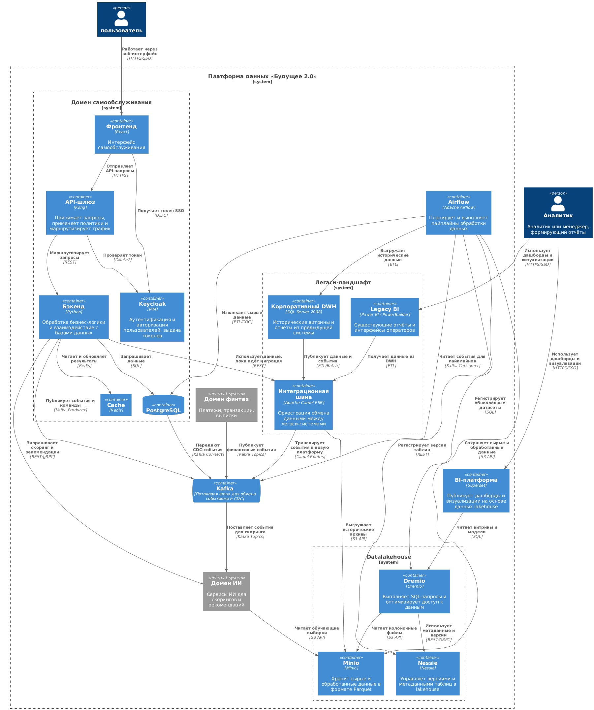

## 1. Целевая архитектура

## 2. Основные проблемные области при переходе

1. Устаревший DWH на неподдерживаемой версии MS SQL — требуется обновление
2. Длительное формирование отчётности, что тормозит процесс принятия решений
3. Отсутствует механизмы контроля качества данных
4. Сильная взаимозависимость между системами

## Приоритизация (MoSCoW)

|   № | Приоритет | Обоснование                                                                                                                                  |
| --: | --------- | -------------------------------------------------------------------------------------------------------------------------------------------- |
|   1 | Must      | Крайне важно снизить время подготовки отчётности и обеспечить консолидацию данных для ускорения бизнес-решений и повышения эффективности     |
|   2 | Must      | Независимое развитие доменных областей — ключевая бизнес-цель; без декомпозиции логики направления fintech и AI не смогут развивать продукты |
|   3 | Must      | Витрина данных является центральным элементом целевой архитектуры; без неё не достижим режим самообслуживания                                |
|   5 | Must      | Соответствие нормативным требованиям в медицине и финтехе обязательно, нарушение ведёт к штрафам или приостановке деятельности               |
|   4 | Should    | Обеспечивает масштабирование новых направлений; становится критичным после стабилизации базовых доменов                                      |
