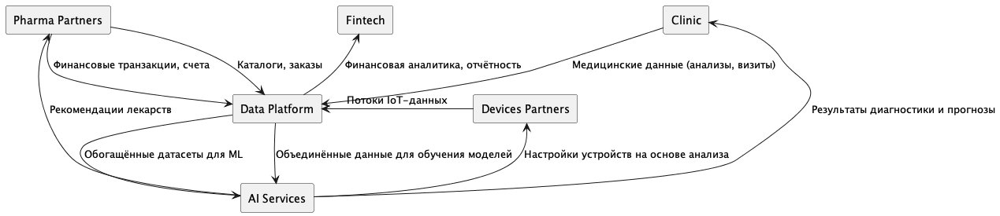

## 1. Логика разделения на домены

| Домен                | Назначение                                            | Основные данные                         | Ключевые сценарии                                 | Причина изоляции                                                     |
| -------------------- | ----------------------------------------------------- | --------------------------------------- | ------------------------------------------------- | -------------------------------------------------------------------- |
| **Clinic**           | Управление пациентами, врачами, услугами, расписанием | Пациенты, визиты, результаты анализов   | Медицинские услуги, интеграция ИИ для диагностики | Изоляция медицинских процессов и данных, требующих повышенной защиты |
| **Fintech**          | Платежи, счета, подписки, партнёрские расчёты         | Транзакции, счета, тарифы               | Быстрое внедрение новых платёжных сервисов        | Независимое развитие финтех-направления и регулирование              |
| **AI Services**      | Аналитика, прогнозирование, распознавание             | Модели, датасеты, результаты вычислений | Диагностика, анализ медицинских изображений       | Отделение экспериментов и ML-пайплайнов от операционной логики       |
| **Pharma Partners**  | Интеграции с фармкомпаниями                           | Каталоги препаратов, заказы, логистика  | Поставки и рекомендации лекарств                  | Гибкая интеграция внешних API                                        |
| **Devices Partners** | Медицинское оборудование, устройства IoT              | Потоки телеметрии, статусы устройств    | Мониторинг здоровья, удалённые сервисы            | Поддержка новых устройств без изменения ядра                         |
| **Data Platform**    | Интеграция, хранение, аналитика                       | ETL, шины данных, витрины               | Отчётность, аналитика, AI-подготовка              | Централизованный обмен данными, не источник бизнес-логики            |

## 2. Data flow diagram

## 3. Обоснование выбранной архитектуры

1. Независимое развитие направлений — новые финтех или ИИ-сервисы внедряются без изменений в остальных системах.
2. Ускорение вывода продуктов — каждая команда развивает свой домен, не блокируя других.
3. Поддержка партнёров — внешние домены (Pharma, Devices) подключаются к интеграционному слою, не затрагивая внутренние сервисы.
4. Преимущества для бизнеса
   - Быстрее разрабатывать и тестировать новые направления.
   - Упростить масштабирование для партнёров.
   - Снизить операционные риски при обновлениях.
   - Повысить скорость аналитики и точность решений.
