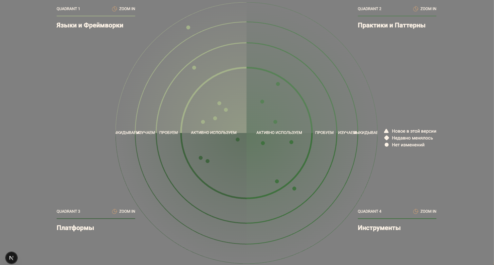
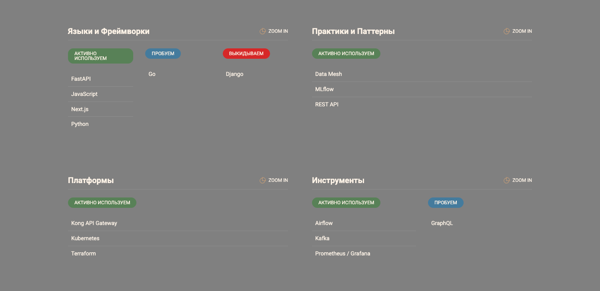

## 1. Techradar

## 2. Roadmap

| Этап                                      | Период     | Основные действия                                                  | Результат                                  | Ответственные            | Ресурсы                |
| ----------------------------------------- | ---------- | ------------------------------------------------------------------ | ------------------------------------------ | ------------------------ | ---------------------- |
| **1. Инфраструктурное основание**         | Q1–Q2 2025 | Внедрение Kubernetes, CI/CD, централизованной авторизации (IAM)    | Унифицированная среда для сервисов         | DevOps Team              | Облако, лицензии CI/CD |
| **2. Доменное разделение**                | Q2–Q3 2025 | Реализация Data Mesh, Kafka, выделение доменов Clinic, Fintech, AI | Независимое развитие направлений           | Архитектурная команда    | Kafka, DWH, DataOps    |
| **4. AI-интеграции и аналитика**          | Q4 2025    | Внедрение MLflow и Airflow, подключение AI к медицинским данным    | Прогнозы и диагностика в реальном времени  | Data Science + AI        | GPU, Vertex AI         |
| **5. Масштабирование и внешние партнёры** | Q1 2026    | Интеграция Pharma и Electronics через API                          | Расширение экосистемы компании             | Partner Integration Team | API Gateway, SDK       |
| **6. Мониторинг и контроль качества**     | Q1–Q2 2026 | Настройка OpenTelemetry, SLA, дашборды качества                    | Стабильность медицинских и финтех-сервисов | SRE Team                 | Grafana, Prometheus    |

## 3. Обоснование изменений

| Этап                           | Цель                                                   | Влияние на бизнес                                    |
| ------------------------------ | ------------------------------------------------------ | ---------------------------------------------------- |
| **Инфраструктурное основание** | Ускорить выпуск сервисов                               | Сокращение time-to-market, стабильная среда          |
| **Доменное разделение**        | Уменьшить зависимость от DWH и централизованных команд | Рост автономности и скорости разработки              |
| **Портал самообслуживания**    | Повысить удобство клиентов и партнёров                 | Снижение затрат на поддержку, рост удовлетворённости |
| **AI-интеграции**              | Улучшить диагностику и прогнозирование                 | Повышение точности решений и снижение ошибок         |
| **Масштабирование и партнёры** | Открыть новые источники дохода                         | Расширение экосистемы, интеграция внешних API        |
| **Мониторинг и качество**      | Снизить операционные риски                             | Прозрачность, контроль SLA, повышение доверия        |
