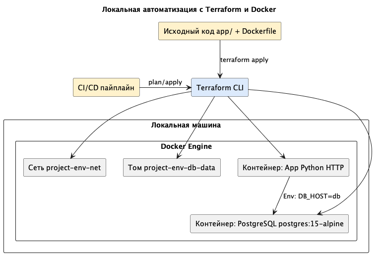
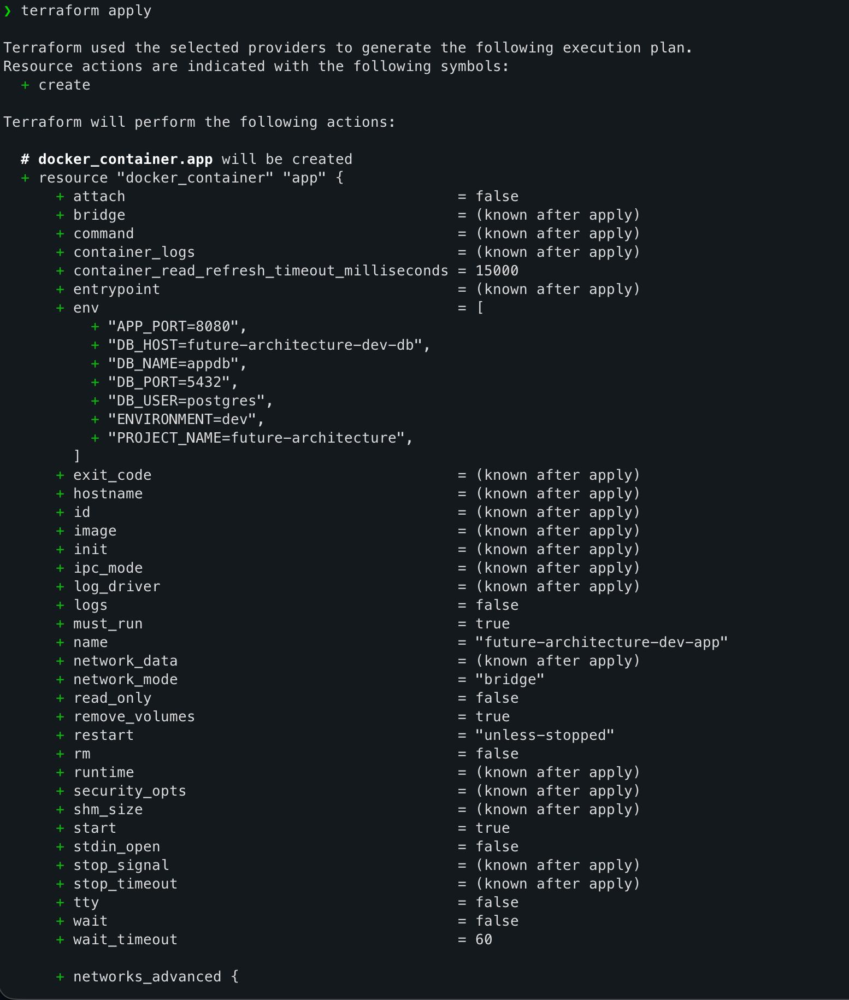
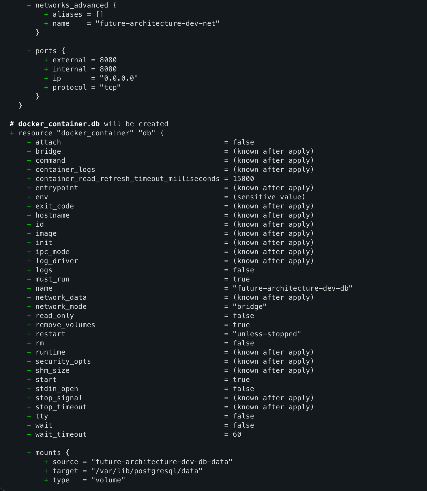
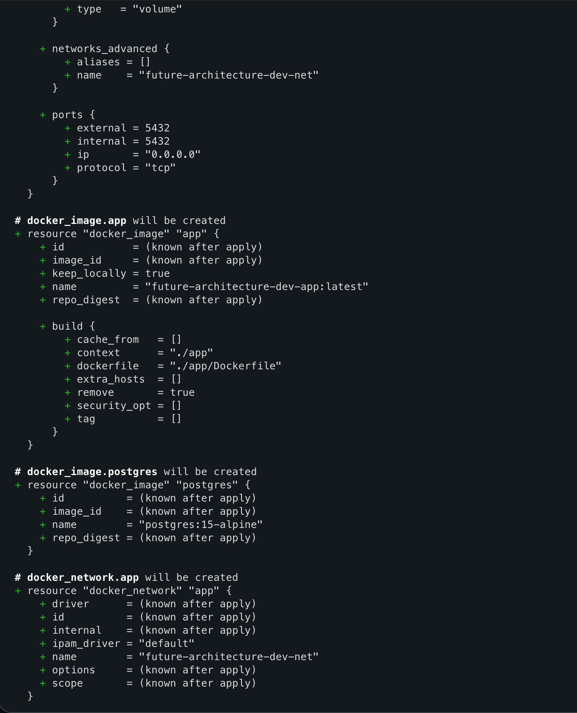
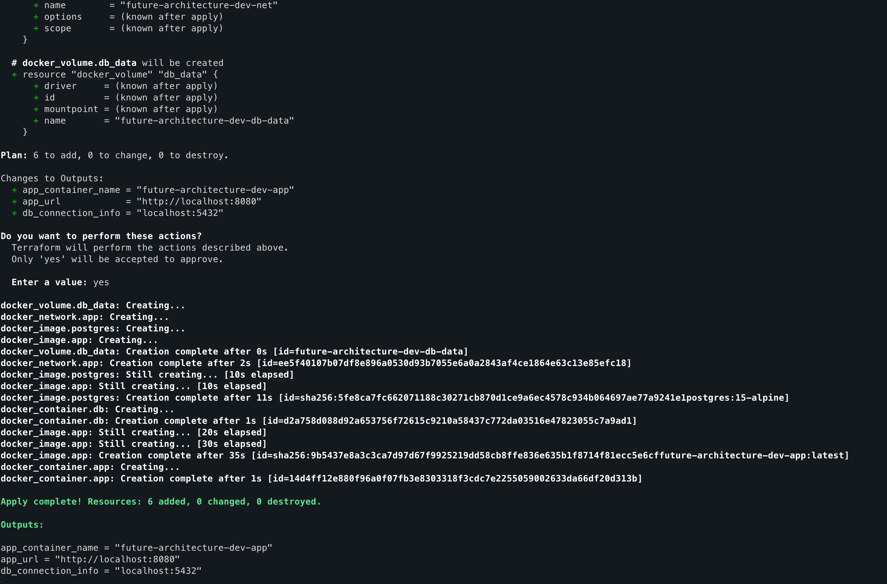

# Задание 4. Автоматизация развёртывания (локально через Docker)

## Диаграмма



## Как запустить

```bash
   terraform init
   terraform plan
   terraform apply
```

Приложение будет на `http://localhost:8080/` ручки - `/health` или `/info`

```bash
   terraform destroy
```





